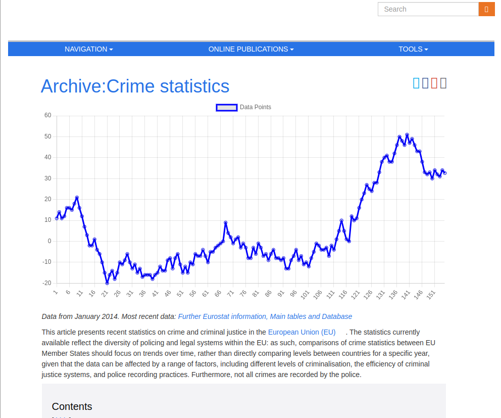

# Data visualisation

## Description
Fetch datas in a HTML code then display them as a chart.

## Preview

## Link to the Website
[https://a3lequenne.github.io/js-datavisualisation-challenge/](https://a3lequenne.github.io/js-datavisualisation-challenge/)

## Technologies used
- HTML
- CSS
- JS (with Chart.JS)
- Ajax

## Development
- git clone the project
- Launch it with LiveServer (will add Vite later)

## Copyright
All rights reserved - 10/11/23